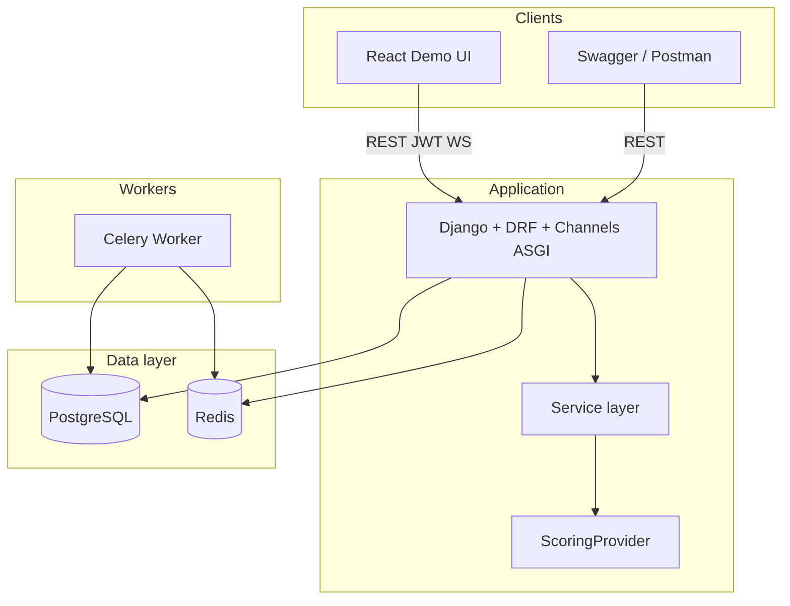

# TalentFlow: AI-Assisted Multi-Tenant ATS

[](https://github.com/Rishavsingh007/TalentFlow-AI-Assisted-Multi-Tenant-ATS/actions/workflows/ci.yml)

Multi-tenant applicant tracking system built as a Django REST API with a thin React demo UI. Companies register, authenticate with JWT, publish jobs, manage recruiter pipelines, and receive public applications with resume uploads, all behind row-level tenant isolation. Resume parsing and AI scoring run asynchronously in Celery, and recruiter dashboards update live over WebSockets.

## Architecture



## Tech stack


| Layer          | Technology                                   |
| -------------- | -------------------------------------------- |
| Backend        | Python 3.12, Django 5, Django REST Framework |
| Auth           | djangorestframework-simplejwt (email login)  |
| API docs       | drf-spectacular                              |
| Database       | PostgreSQL 16                                |
| Cache / broker | Redis 7, django-redis                        |
| Async          | Celery                                       |
| Real-time      | Django Channels, Redis channel layer         |
| Email (dev)    | MailHog                                      |
| Server         | Daphne (ASGI — HTTP + WebSocket)             |
| Config         | django-environ                               |
| Containers     | Docker, docker-compose                       |
| Demo UI        | React 19, Vite, TypeScript, Tailwind CSS, React Router |
| Testing        | pytest, pytest-django, factory_boy           |


## API


| Method          | Endpoint                                            | Auth | Description                                                  |
| --------------- | --------------------------------------------------- | ---- | ------------------------------------------------------------ |
| `POST`          | `/api/v1/auth/register/`                            | No   | Create company, admin user, and JWT                          |
| `POST`          | `/api/v1/auth/login/`                               | No   | Email/password → access + refresh tokens                     |
| `POST`          | `/api/v1/auth/refresh/`                             | No   | Refresh token → new access token (old refresh blacklisted)   |
| `POST`          | `/api/v1/auth/ws-ticket/`                           | JWT  | Issue short-lived WebSocket connection ticket                |
| `GET` / `PATCH` | `/api/v1/companies/{slug}/`                         | JWT  | Company profile (members only; PATCH requires admin)         |
| `GET` / `POST`  | `/api/v1/companies/{slug}/jobs/`                    | JWT  | List jobs (members) or create draft (recruiter/admin)        |
| `GET` / `PATCH` | `/api/v1/companies/{slug}/jobs/{id}/`               | JWT  | Retrieve job (members) or update (recruiter/admin)           |
| `POST`          | `/api/v1/companies/{slug}/jobs/{id}/publish/`       | JWT  | Publish draft job (recruiter/admin)                          |
| `GET`           | `/api/v1/companies/{slug}/applications/`            | JWT  | List applications; filters: `job`, `current_stage`, `status` |
| `GET`           | `/api/v1/companies/{slug}/applications/{id}/`       | JWT  | Application detail with candidate and pipeline stages        |
| `PATCH`         | `/api/v1/companies/{slug}/applications/{id}/stage/` | JWT  | Move application stage (recruiter/admin)                     |
| `GET`           | `/api/v1/companies/{slug}/applications/{id}/score/` | JWT  | Read AI score and summary (members)                          |
| `POST`          | `/api/v1/companies/{slug}/applications/{id}/score/` | JWT  | Queue re-score (202 `queued`; recruiter/admin)               |
| `GET`           | `/api/v1/companies/{slug}/audit-logs/`              | JWT  | Paginated audit trail; filters: `action`, `object_type`      |
| `GET`           | `/api/v1/jobs/`                                     | No   | Public list of open jobs                                     |
| `GET`           | `/api/v1/jobs/{id}/`                                | No   | Public detail for an open job                                |
| `POST`          | `/api/v1/jobs/{id}/apply/`                          | No   | Submit application (multipart: name, email, phone, resume)   |
| `GET`           | `/health/`                                          | No   | Health check                                                 |
| `GET`           | `/api/docs/`                                        | No   | Swagger UI                                                   |


### Async & AI

After applying, resume parsing and AI scoring run in **Celery** (web returns 201 immediately). Use `AI_PROVIDER=mock` for offline demo and CI.


| Step  | Task                                                 | Result                                               |
| ----- | ---------------------------------------------------- | ---------------------------------------------------- |
| Apply | `parse_resume` + `send_application_received_email`   | Queued on commit                                     |
| Parse | No-op scan → PDF/DOCX text extraction                | `Application.parsed_resume_text`                     |
| Score | `ScoringProvider` (mock by default)                  | `Application.ai_score`, `ai_summary`, `ai_scored_at` |
| Audit | `application.scored` or `application.scoring_failed` | Append-only audit row                                |


**Score API:** `GET|POST /api/v1/companies/{slug}/applications/{id}/score/` — GET returns current score; POST queues async re-score and returns `202` with `{"status": "queued", "application_id": ...}` (recruiter/admin only).

**Local email:** MailHog UI at [http://localhost:8025/](http://localhost:8025/) when using Docker Compose.

### Real-time 

Recruiter dashboards receive **live pipeline events** over WebSockets. The `web` service runs **Daphne** (ASGI) so HTTP and WS share port 8000.

**WebSocket URL:** `ws://localhost:8000/ws/companies/{slug}/dashboard/?ticket=<ws_ticket>`

1. `POST /api/v1/auth/ws-ticket/` with JWT → `{"ticket": "...", "expires_in": 30}`
2. Connect with `ticket` query parameter (single-use, 30s TTL)

- Company members only — missing/invalid/expired ticket closes with `4401`; non-members with `4404`.
- Channel group per tenant: `company_{id}_dashboard`.


| Event                       | Trigger                                     |
| --------------------------- | ------------------------------------------- |
| `application.received`      | Public apply commits (`submit_application`) |
| `application.scored`        | Celery `run_scoring` completes              |
| `application.stage_changed` | `move_stage`                                |


**Sample payload (`application.stage_changed`):**

```json
{
  "event": "application.stage_changed",
  "application_id": 42,
  "from_stage": "Screening",
  "to_stage": "Interview",
  "actor": "recruiter@acme.com",
  "timestamp": "2026-06-14T12:00:00+00:00"
}
```

**Verify (after seed + login):**

Rebuild the `web` service if it was started before (`docker compose up --build -d web`) — WebSockets require **Daphne**, not Gunicorn.

```powershell
$tokens = Invoke-RestMethod -Method POST -Uri "http://localhost:8000/api/v1/auth/login/" `
  -ContentType "application/json" `
  -Body (@{ email = "recruiter@acme.com"; password = "demo-password-123" } | ConvertTo-Json)

$headers = @{ Authorization = "Bearer $($tokens.access)" }
$ticket = Invoke-RestMethod -Method POST -Uri "http://localhost:8000/api/v1/auth/ws-ticket/" -Headers $headers

# Option A — npx (no global install; requires Node.js)
# --origin is required: AllowedHostsOriginValidator rejects connections without it
npx --yes wscat -c "ws://localhost:8000/ws/companies/acme-corp/dashboard/?ticket=$($ticket.ticket)" --origin http://localhost

# Option B — browser DevTools → Console (fetch ticket first, then connect):
# fetch('/api/v1/auth/ws-ticket/', { method: 'POST', headers: { Authorization: 'Bearer ' + accessToken } })
#   .then(r => r.json()).then(({ ticket }) => new WebSocket(`ws://localhost:8000/ws/companies/acme-corp/dashboard/?ticket=${ticket}`))
```

Apply to a job or move to another stage in the terminal — events appear in the WS client. The React demo UI connects automatically on the pipeline screen.

### Demo UI 

Thin React + Vite + TypeScript recruiter UI in `frontend/` — three screens wired to the REST API and WebSocket layer with hooks and `fetch` (no Redux). Styling is Tailwind CSS.

| Screen | Route | Auth | Description |
| ------ | ----- | ---- | ----------- |
| Public apply | `/apply` | No | List open jobs, submit resume (multipart); shows async-scoring notice on success |
| Login | `/login` | No | Email + password + company slug; verifies membership before entering |
| Recruiter pipeline | `/pipeline/:companySlug` | JWT | Columns by stage; live WebSocket updates; per-card stage dropdown |
| Audit trail | `/audit/:companySlug` | JWT | Paginated audit log with action filter |

**Run the UI** (with Docker backend up and seed data loaded):

```bash
cd frontend
cp .env.example .env
npm install
npm run dev
```

- Demo UI: [http://localhost:5173/](http://localhost:5173/)
- Login: `recruiter@acme.com` / `demo-password-123` / company slug `acme-corp`

**5-minute demo flow:** Apply on `/apply` with a PDF → log in → open Pipeline → watch the new card appear and AI score update via WebSocket → move a stage → check Audit.

Full interview script: [scripts/demo_walkthrough.md](./scripts/demo_walkthrough.md) and [TALENTFLOW_ARCHITECTURE.md](./TALENTFLOW_ARCHITECTURE.md) §2.

**How the UI talks to the backend:**

- **Auth:** Login stores access + refresh tokens (sessionStorage). A central `fetch` wrapper attaches `Authorization: Bearer`, transparently refreshes on `401`, and persists the rotated refresh token (backend uses `ROTATE_REFRESH_TOKENS` + blacklist). When refresh fails, React auth state is cleared so the nav reflects the logged-out session immediately.
- **Tenancy:** Protected routes are guarded so a logged-in user can only open their own company slug; mismatched slugs redirect to the authenticated tenant.
- **Real-time:** The pipeline screen fetches a fresh single-use `ws-ticket` before each connect, connects with `?ticket=`, and applies `application.received` / `application.scored` / `application.stage_changed` events to the board. It reconnects with exponential backoff on transient drops but stops on fatal closes (`4401`/`4404`) and on a failed ticket fetch. A status badge shows Connected / Reconnecting / Offline.

See [TALENTFLOW_ARCHITECTURE.md](TALENTFLOW_ARCHITECTURE.md) §2 for talking points.

### Postman

Import [docs/postman/talentflow.json](./docs/postman/talentflow.json) into Postman or Insomnia.

1. Set `baseUrl` to `http://localhost:8000` (or your Render URL).
2. Run **Auth → Login** (seeds tokens into collection variables).
3. Exercise **Public → Apply**, **Company → List Applications / Move Stage / Audit Logs**.

For a multipart application, attach a PDF to the `resume` form field.

### RBAC 


| Role             | List applications | Move stage | Create/edit/publish jobs |
| ---------------- | ----------------- | ---------- | ------------------------ |
| `admin`          | yes               | yes        | yes                      |
| `recruiter`      | yes               | yes        | yes                      |
| `hiring_manager` | yes               | no (403)   | no (403)                 |
| non-member       | 404               | 404        | 404                      |


Authorization uses `CompanyMember.role`, not `User.role`.

## Demo seed data

After Docker is up:

```bash
docker compose exec web python scripts/seed_demo.py
```


| Tenant     | Slug         | User                   | Password            | Role      |
| ---------- | ------------ | ---------------------- | ------------------- | --------- |
| Acme Corp  | `acme-corp`  | `admin@acme.com`       | `demo-password-123` | admin     |
| Acme Corp  | `acme-corp`  | `recruiter@acme.com`   | `demo-password-123` | recruiter |
| Globex Inc | `globex-inc` | `recruiter@globex.com` | `demo-password-123` | recruiter |


Globex exists to demo cross-tenant isolation (Acme users get 404 on Globex resources).

## Project structure

```
config/                 # Django settings, urls, wsgi
apps/
  accounts/             # User model (email login), register, JWT views
  companies/            # Company, CompanyMember, access helpers
  jobs/                 # Job model, publish service, public + company APIs
  candidates/           # Per-tenant candidate contact records (company + email)
  applications/         # Application model, apply flow, move_stage pipeline
  ai_scoring/           # Celery parse/score tasks, ScoringProvider
  notifications/        # Email tasks, WebSocket consumer, broadcast helpers
  audit/                # Append-only AuditLog and log_action service
  core/                 # Health check, permissions, upload validation, scan stub
frontend/               # React demo UI (Vite + TypeScript + Tailwind)
  src/
    api/                # fetch client (JWT refresh), auth/jobs/applications/audit/companies
    hooks/              # useAuth (context), useWebSocket (ticketed dashboard stream)
    pages/              # ApplyPage, LoginPage, PipelinePage, AuditPage
    components/         # Layout, RequireAuth, RequireCompanySlug, pipeline + audit views
    types/              # API types mirroring DRF serializers
scripts/
  seed_demo.py          # Acme + Globex demo tenants
  demo_walkthrough.md   # 5-minute interview / recording script
docs/postman/
  talentflow.json       # Postman collection
.github/workflows/
  ci.yml                # ruff, black, pytest, pip-audit, frontend build, docker
render.yaml             # Render Blueprint (web + worker + Postgres + Redis)
tests/
docker/entrypoint.sh    # Wait for DB, migrate, exec Daphne CMD
```

## Prerequisites

- Python 3.12 (`python --version`)
- Node.js 18+ (`node --version`) — for the demo UI
- Docker Desktop

## Quick start (Docker)

```bash
cp .env.example .env
docker compose up --build -d
docker compose exec web python scripts/seed_demo.py
```

- Swagger: [http://localhost:8000/api/docs/](http://localhost:8000/api/docs/)
- Health: [http://localhost:8000/health/](http://localhost:8000/health/)
- MailHog: [http://localhost:8025/](http://localhost:8025/)
- Celery worker starts automatically (`celery_worker` service)

**Demo UI** (separate terminal):

```bash
cd frontend && cp .env.example .env && npm install && npm run dev
```

Open [http://localhost:5173/apply](http://localhost:5173/apply).

Uploaded resumes are persisted in the `media_data` Docker volume.

## Deploy (Render)

[render.yaml](./render.yaml) defines a Blueprint: Daphne web service, Celery worker, managed Postgres, and Redis.

1. Push this repo to GitHub.
2. In Render: **New → Blueprint** → select the repo.
3. After first deploy, set:
   - `ALLOWED_HOSTS` — your web service hostname (e.g. `talentflow-web.onrender.com`)
   - `CORS_ALLOWED_ORIGINS` — demo UI origin (Vercel/Netlify/static site URL, or leave empty for API-only)
4. Seed once (Render Shell on `talentflow-web`):

```bash
python scripts/seed_demo.py
```

5. Optional frontend: deploy `frontend/` as a static site with `VITE_API_BASE_URL=https://<your-api-host>`.

Stripe test webhooks are **not** configured here. Use `AI_PROVIDER=mock` unless you add live provider keys.

## Quick start (local venv)

```bash
python -m venv .venv
.\.venv\Scripts\Activate.ps1   # Windows
pip install -r requirements-dev.txt

cp .env.example .env
docker compose up -d db redis mailhog

python manage.py migrate
python scripts/seed_demo.py
# Terminal 2: celery -A config worker -l info
python manage.py runserver
```

## API examples

On **Windows PowerShell**, prefer `Invoke-RestMethod` (bash `curl` quoting often breaks JSON).

**Login (after seed):**

```powershell
$tokens = Invoke-RestMethod -Method POST -Uri "http://localhost:8000/api/v1/auth/login/" `
  -ContentType "application/json" `
  -Body (@{
    email    = "recruiter@acme.com"
    password = "demo-password-123"
  } | ConvertTo-Json)

$headers = @{ Authorization = "Bearer $($tokens.access)" }
```

**List pipeline applications:**

```powershell
Invoke-RestMethod -Uri "http://localhost:8000/api/v1/companies/acme-corp/applications/" -Headers $headers
```

**Filter by stage:**

```powershell
Invoke-RestMethod -Uri "http://localhost:8000/api/v1/companies/acme-corp/applications/?current_stage=Screening" -Headers $headers
```

**Move application stage:**

```powershell
Invoke-RestMethod -Method PATCH `
  -Uri "http://localhost:8000/api/v1/companies/acme-corp/applications/1/stage/" `
  -Headers $headers `
  -ContentType "application/json" `
  -Body (@{ current_stage = "Interview" } | ConvertTo-Json)
```

**View audit trail (after moving stages or publishing jobs):**

```powershell
Invoke-RestMethod -Uri "http://localhost:8000/api/v1/companies/acme-corp/audit-logs/" -Headers $headers
```

**Filter audit logs by action:**

```powershell
Invoke-RestMethod -Uri "http://localhost:8000/api/v1/companies/acme-corp/audit-logs/?action=application.stage_changed" -Headers $headers
```

**Create and publish a job:**

```powershell
$job = Invoke-RestMethod -Method POST -Uri "http://localhost:8000/api/v1/companies/acme-corp/jobs/" `
  -Headers $headers `
  -ContentType "application/json" `
  -Body (@{
    title            = "Backend Engineer"
    description      = "Build APIs with Django"
    department       = "Engineering"
    location         = "Remote"
    employment_type  = "full_time"
  } | ConvertTo-Json)
```

**Apply with resume (use curl on older PowerShell — no `-Form` support):**

```powershell
curl.exe -X POST "http://localhost:8000/api/v1/jobs/1/apply/" `
  -F "full_name=Jane Doe" `
  -F "email=jane@example.com" `
  -F "phone=555-1234" `
  -F "resume=@resume.pdf;type=application/pdf"
```


## Environment variables

Backend variables live in [.env.example](./.env.example); the frontend reads `VITE_API_BASE_URL` from [frontend/.env.example](./frontend/.env.example).


| Variable                               | Purpose                                    |
| -------------------------------------- | ------------------------------------------ |
| `DJANGO_SECRET_KEY`                    | Django secret                              |
| `DATABASE_URL`                         | PostgreSQL connection                      |
| `REDIS_URL`                            | Redis cache and Celery broker              |
| `AI_PROVIDER`                          | `mock` (default), `openai`, or `anthropic` |
| `OPENAI_API_KEY` / `ANTHROPIC_API_KEY` | Live AI providers (optional)               |
| `EMAIL_HOST` / `EMAIL_PORT`            | MailHog in Docker (`mailhog:1025`)         |
| `CORS_ALLOWED_ORIGINS`                 | Allowed browser origins (Vite dev: `http://localhost:5173`) |
| `API_KEY_PEPPER`                       | Secret for API key hashing                 |
| `VITE_API_BASE_URL` (frontend)         | API origin the demo UI calls (`http://localhost:8000`) |


